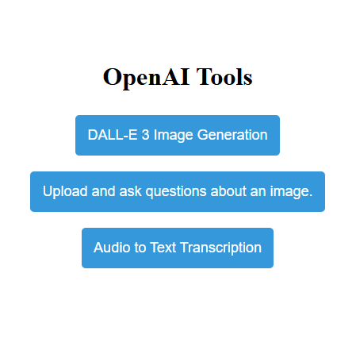

# openai
Experiments with the OpenAI API. You'll need your own API keys.  Define 'em in the
**OPENAI_API_KEY** environment variable.

There is little to no error handling, that's just how I roll.

## Python
Latest update, I was running Python 3.11 but my docker container was using 3.8-slim. This is mostly because I can't be trusted to remain consistent, even within the same repo.

You'll want to start with `pip install openai`; if you know how to work with virtualenv, you should probably do that. I'm from the before-times, when your entire toolchain was your single-instance ride-or-die. If a new library came out, you either spun up a VM or ran it on an old laptop you had in inventory, or you took your chances that updating for your current project would destroy all your prior work. And that's the way we liked it.

I've consolidated all the weird experimenting I was doing into a single three-route flask-based `app.py` that I host on a Docker container.  Everything now runs off of `app.py`.

To try it locally (sans docker) clone the repo, install the dependencies (refer to requireements.txt), create an .env file, probably, with your OPENAI_API_KEY and your FLASK_SECRET_KEY, and in the root of the repo, run `flask run`, and if I didn't forget something important in these instructions, it fires up an instance on localhost:5000.

If you want to run it on docker, there are some notes in the `build-instructions.txt` file, but they're specific to my environment. You'll need to figure out your own volume mapping.

I've even included a dockerfile! But, once again, at this point, it should be noted: I don't *really* know what I'm doing.  That's not imposter syndrome, that's an admission of legitimate ignorance.  If I knew what I was doing I'd have probably used docker compose.  But I just gave my dependencies to ChatGPT and said, "hey, how would I run this in docker" and then I made sure to strip out any hard-coded API keys before committing it to the repo.  It was enough to get me there.  Past Track set up docker remote running on my Syno. I can't walk you through that because I have no memory of how I did it.

None.

I was actually surprised when docker didn't build locally. I muddled through half a dozen helpfiles before I found "docker context list" and saw that I had an SSH connection to my syno endpoint.

I'm gonna be so screwed when I upgrade my dev desktop. You may think this is pointless rambling, but these are breadcrumbs I'm leaving for future Track.

Where were we....Oh yes! The Flask app will currently persist your prompt and image settings between submissions for the session.

And, for whatever reason, I have the docker container exposing port 5050 when the flask app uses 5000.

## So...you gonna talk about the app, or...

Oh.  Yeah, right, ok. Here's the current main interface

And from there, each of the buttons takes you to a different flask route.  They more or less do what it says on the button.

### Image Generation (top button)

Your own personal version of DALL-E 3, using the `dall-e-3` model.

Here's a screenshot:

### Image Analysis (middle button)

This sample uses the `gpt-4o` model to generate a text description of an image passed in through the command line.

### Audio transcription (bottom button)

Audio to Text transcription uses the OpenAI whisper endpoint and the `whisper-1` model, but you could probably run it local if you were so inclined.  I was not.  That particular module still has some rough edges, but it *should* automatically chunk your larger audio files into 25MB bits that work with the API. And 60% of the time, it works every time.

Also, while I put the other model variables in the top of the `app.py` file, this one I coded into the audio app.route directly. No, I can't explain why.

And...uh...I...I already warned you about the error handling, right?

----

## ARCHIVE
I started with a bunch of individual scripts and expreiments, most starting as CLI.  I dumped all of that into the archive folder but left the original notes below.

If you want to read them for whatever reason, then click here to expand

All of these samples have been brought up to v1.1.1 (Nov 6 2023)

## Image Generation

### oai-generate-image.py
Your own personal command-line version of DALL-E 3. (Might need to `pip install pillow` on the CLI version)

For more flexibility, use the Flask (`pip install Flask`) app under `OpenAI-DALLE-LocalWebApp`

Here's a screenshot:

You can run it locally, but I've included a dockerfile if you want to try to run it in a container.  At this point, it should be noted: I don't *really* know what I'm doing.  That's not imposter syndrome, that's an admission of legitimate ignorance.

I just gave my dependencies to ChatGPT and said, "hey, how would I run this in docker" and then I made sure to strip out any hard-coded API keys before committing it to the repo.  It was enough to get me there.  Past Track set up docker remote running on my Syno. I can't walk you through that because I have no memory of how I did it.

None.

I was actually surprised when docker didn't build locally. I muddled through half a dozen helpfiles before I found "docker context list" and saw that I had an SSH connection to my syno endpoint.

I'm gonna be so screwed when I upgrade my dev desktop. You may think this is pointless rambling, but these are breadcrumbs I'm leaving for future Track.

Where were we....Oh yes! The Flask app will currently persist your prompt and image settings between submissions for the session.

----
## Text Generation
Each of these examples builds upon the prior.

### oai-text-gen.py
ChatGPT from the command line, but you just need your API key in the OPENAI_API_KEY environment variable.

### oai-text-gen-with-secrets.py
ChatGPT from the command line, but pull the API key from AWS Secrets Manager (with fallback to OS Environment Variables).  You have to have AWS auth env variables set up on your system to use this. Uses Secrets Manager Caching where applicable.

You'll need to `pip install aws-secretsmanager-caching` for this one. Oh, and `boto3` and `botocore`

### oai-text-gen-with-secrets-and-streaming.py
Added streaming responses & token tracking into the mix. I'm not 100% sure the token tracking is accurate, so don't count on it for billing. It should be close for gpt3.5-turbo and gpt-4, but again, I don't *really* know what I'm doing.

----
## Image Analysis

### oai-vision-py

This sample uses the gpt-4-image-preview model to generate a text description of an image passed in through the command line.

`usage: oai-vision.py /path/to/image.jpg` (on windows, path can be d:\path\to\image.jpg)

### OAI-Vision-Local-WebApp
Added a Flask wrapper for the OAI Vision preview.  Install dependencies, run `app.py`. I did not create a dockerfile for this one.

### OAI-Image-Tools
Combined the two flask apps for OAI Image Generation and Vision preview so they can be run in a single container.

Then in November 2024 I added a third route to do audio to text conversion but I didn't bother changing the directory name.  It's fine, I'm sure I'll get to it soon.

